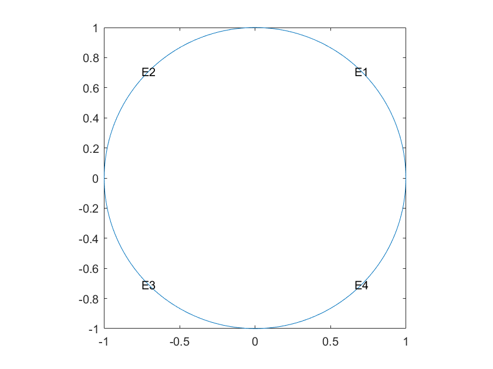
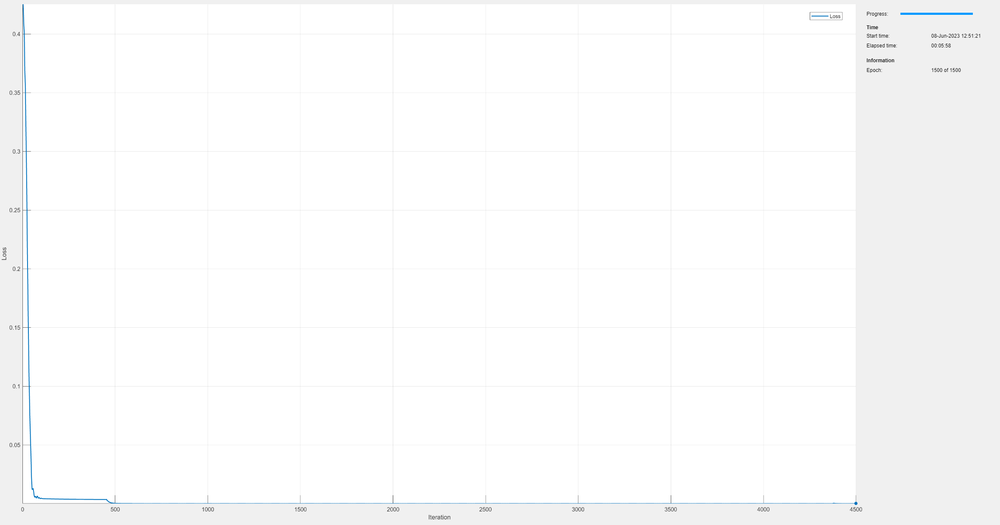
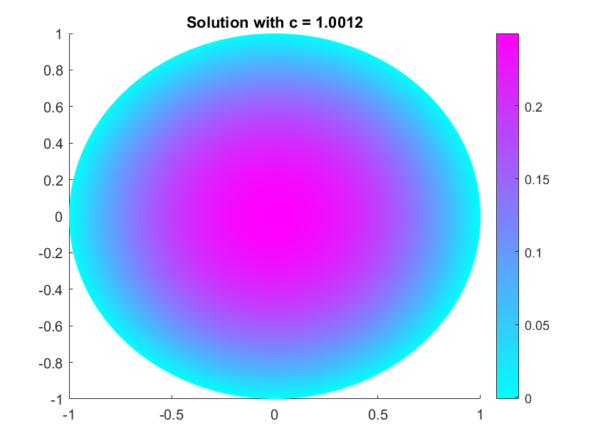
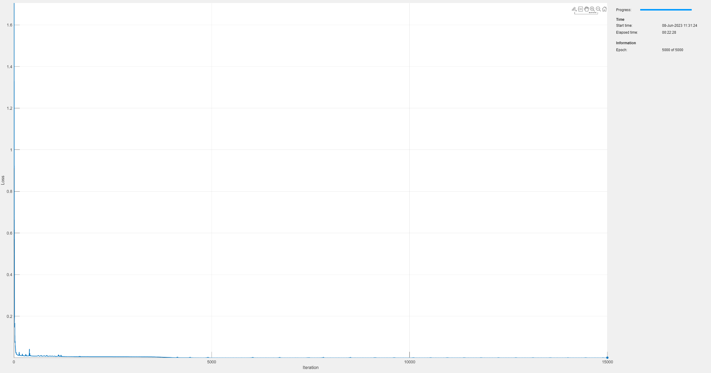
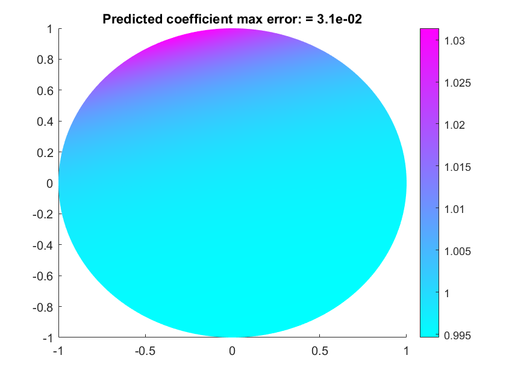

# Inverse Problems using PINNs

This repository was originally hosted [here](https://github.com/matlab-deep-learning/Inverse-Problems-using-Physics-Informed-Neural-Networks-PINNs).

## Overview
This repository contains two examples: [`InversePinnConstantCoef.mlx`](./InversePinnConstantCoef.mlx) and [`InversePinnVariableCoef.mlx`](./InversePinnVariableCoef.mlx). Both examples are solvers for an inverse problem for the Poisson equation $−\nabla \cdot (c\nabla u)=1$ with suitable boundary conditions. In particular, this is a parameter estimation problem in which we assume that we have an exact solution u, and we are interested in computing an approximation to the coefficient $c$. 

The first example, InversePinnConstantCoef, shows how to solve the parameter estimation problem when $c$ is a constant. In the example, a PINN corresponding to the solution is trained, and while training the PINN, the coefficient is optimized. Both the network parameters and the coefficient are trained using the Adam algorithm. This results in an approximation for the coefficient to be found and a PINN that can be used to approximate the solution. 

The second example is essentially the same setup as the first. However, rather than using a constant coefficient, the coefficient is also approximated by a neural network. Both the PINN and coefficient networks are trained simulataneously. After training, there are two networks, one which approximates the PDE and one which approximates the coefficient. 


## PINNs for Inverse Problems : Constant Coefficients

The Poisson equation on a unit disk with zero Dirichlet boundary condition can be written as $-\nabla\cdot (c \nabla u) = 1$ in $\Omega$, $u=0$ on $\partial \Omega$, where $\Omega$ is the unit disk. The exact solution when $c=1$ is $$u(x,y) = \frac{1 - x^2 - y^2}{4}$$

This equation is relevant for example in therodynamics, where this describes a steady state heat equation, with the boundary of the circle held at a constant temperature of 0, the right hand side of the equation is a volumetric heat source, and the coefficient $c$ is the thermal diffusivity. The typical "forward" problem is to use this information to find u.
One could consider the inverse problem: given a known temperature distribution $u$ corresponding to the solution at a set of points, a known volumetric heat source, and boundary conditions, what is the thermal diffusivity? Using a PINN to solve the equation, we can optimize the PINN parameters and the optimize to solve for the coefficient at the same time. In this exmaple, we will take the data to be given by the exact solution above. In practice, the exact solution is often not known, but measurements of the solution can be provided instead. 

### PDE Model Definition

```matlab:Code
rng('default'); % for reproducibility
model = createpde();
geometryFromEdges(model,@circleg);
applyBoundaryCondition(model,"dirichlet", ...
                             "Edge",1:model.Geometry.NumEdges, ...
                             "u",0);
```

Plot the geometry and display the edge labels for use in the boundary condition definition.

```matlab:Code
figure 
pdegplot(model,"EdgeLabels","on"); 
axis equal
```



Create a structural array of coefficents. Specify the coefficients to the PDE model. Note that pdeCoeffs.c is an initial guess; it will be updated during training. We also define pdeCoeffs to be a struct of dlarrays so that we can compute gradients with respect to them. 

```matlab:Code
pdeCoeffs.c = .5;
% fixed values for other coefficients
pdeCoeffs.m = 0;
pdeCoeffs.d = 0;
pdeCoeffs.a = 0;
pdeCoeffs.f = 1;
% set up model
specifyCoefficients(model,"m",pdeCoeffs.m,"d",pdeCoeffs.d,"c",pdeCoeffs.c,"a",pdeCoeffs.a,"f",pdeCoeffs.f);
Hmax = 0.05; Hgrad = 2; Hedge = Hmax/10;
msh = generateMesh(model,"Hmax",Hmax,"Hgrad",Hgrad,"Hedge",{1:model.Geometry.NumEdges,Hedge});
% make coefs dlarrays so gradients can be computed
pdeCoeffs = structfun(@dlarray,pdeCoeffs,'UniformOutput',false); 
```

### Generate Spatial Data for Training PINN

This examples uses mesh nodes as the collocation points. Model loss at the collocation points on the domain and boundary are used to train the PINN. 

```matlab:Code
boundaryNodes = findNodes(msh,"region","Edge",1:model.Geometry.NumEdges);
domainNodes = setdiff(1:size(msh.Nodes,2),boundaryNodes);
domainCollocationPoints = msh.Nodes(:,domainNodes)';
```

### Define Deep Learning Model

This is a neural network with 3 hidden layers and 50 neurons per layer. The two inputs to the network correspond to the x and y coordinates, and the one output corresponds to the solution, so predict(pinn,XY) appoximates u(x,y). While training the c coefficient, we will also train this neural network to provide solutions to the PDE. 

```matlab:Code
numLayers = 3;
numNeurons = 50;
layers = featureInputLayer(2);
for i = 1:numLayers-1
    layers = [
        layers
        fullyConnectedLayer(numNeurons)
        tanhLayer];%#ok<AGROW>
end
layers = [
    layers
    fullyConnectedLayer(1)];
pinn = dlnetwork(layers);
```

### Define Custom Training Loop to Train the PINN Using ADAM Solver

Specify training options. Create arrays for average gradients and square gradients for both the PINN and the parameter; both will be trained using the ADAM solver. 

```matlab:Code
numEpochs = 1500;
miniBatchSize = 2^12;
initialLearnRate = 0.01;
learnRateDecay = 0.001;
averageGrad = []; % for pinn updates
averageSqGrad = [];
pAverageGrad = []; % for parameter updates
pAverageSqGrad = []; 
```

Setup data store for the training points. For simplicity, we both train the PINN and compute the known data at the mesh nodes.

```matlab:Code 
ds = arrayDatastore(domainCollocationPoints);
mbq = minibatchqueue(ds, MiniBatchSize = miniBatchSize, MiniBatchFormat="BC");
Calculate the total number of iterations for the training progress monitor and initialize the monitor. 
numIterations = numEpochs * ceil(size(domainCollocationPoints,1)/miniBatchSize);
monitor = trainingProgressMonitor(Metrics="Loss",Info="Epoch",XLabel="Iteration");
```

### Training Loop

Train the model and parameter using a custom training loop. Update the network parameters using the adamupdate function. At the end of each iteration, display the training progress. Note that we allow the PINN to be trained for 1/10th of the epochs before updating the c coefficient. This helps with robustness to the initial guess. 

```matlab:Code
iteration = 0;
epoch = 0;
learningRate = initialLearnRate;
lossFcn = dlaccelerate(@modelLoss);
while epoch < numEpochs && ~monitor.Stop
    epoch = epoch + 1;
    reset(mbq);
    while hasdata(mbq) && ~monitor.Stop
        iteration = iteration + 1;
        XY = next(mbq);
        % Evaluate the model loss and gradients using dlfeval.
        [loss,gradients] = dlfeval(lossFcn,model,pinn,XY,pdeCoeffs);
        % Update the network parameters using the adamupdate function.
        [pinn,averageGrad,averageSqGrad] = adamupdate(pinn,gradients{1},averageGrad,...
                                               averageSqGrad,iteration,learningRate);
        % Update the c coefficient using the adamupdate function. Defer
        % updating until 1/10 of epochs are finished.
        if epoch > numEpochs/10
            [pdeCoeffs.c,pAverageGrad,pAverageSqGrad] = adamupdate(pdeCoeffs.c,gradients{2},pAverageGrad,...
                                               pAverageSqGrad,iteration,learningRate);
        end
    end
    % Update learning rate.
    learningRate = initialLearnRate / (1+learnRateDecay*iteration);
    % Update the training progress monitor.
    recordMetrics(monitor,iteration,Loss=loss);
    updateInfo(monitor,Epoch=epoch + " of " + numEpochs);
    monitor.Progress = 100 * iteration/numIterations;
end
```



### Visualize Data

Evaluate PINN at mesh nodes and plot, include updated value of c in title. Note that c = 1.001, compared to the exact value of 1, this is a 0.1% error. 

```matlab:Code
nodesDLarry = dlarray(msh.Nodes,"CB");
Upinn = gather(extractdata(predict(pinn,nodesDLarry)));
figure;
pdeplot(model,"XYData",Upinn);
title(sprintf("Solution with c = %.4f",double(pdeCoeffs.c)));
```


### Model Loss Function

The `modelLoss` helper function takes a [`dlnetwork`](https://mathworks.com/help/deeplearning/ref/dlnetwork.html) object `pinn` and a mini-batch of input data `XY`, and returns the loss and the gradients of the loss with respect to the learnable parameters of the PINN, and with respect to the c coefficient. To compute the gradients automatically, use the [`dlgradient`](https://mathworks.com/help/deeplearning/ref/dlarray.dlgradient.html) function. Return the gradients w.r.t. learnable and w.r.t the parameter as two elements of a cell array so they can be used separately.  The model is trained by enforcing that given an input the output of the network satsifies Poisson's equation and the boundary conditions.

```matlab:Code
function [loss,gradients] = modelLoss(model,pinn,XY,pdeCoeffs)
dim = 2;
U = forward(pinn,XY);

% Loss for difference in data taken at mesh nodes. 
Utrue = getSolutionData(XY);
lossData = l2loss(U,Utrue);

% Compute gradients of U and Laplacian of U.
gradU = dlgradient(sum(U,"all"),XY,EnableHigherDerivatives=true);
Laplacian = 0;
for i=1:dim
    % Add each term of the Laplacian
    gradU2 = dlgradient(sum(pdeCoeffs.c.*gradU(i,:),"all"),XY,EnableHigherDerivatives=true);
    Laplacian = gradU2(i,:)+Laplacian;
end

% Enforce PDE. Calculate lossF.
res = -pdeCoeffs.f - Laplacian + pdeCoeffs.a.*U;
lossF = mean(sum(res.^2,1),2);

% Enforce boundary conditions. Calculate lossU.
actualBC = []; % contains the actual boundary information
BC_XY = []; % boundary coordinates
% Loop over the boundary edges and find boundary coordinates and actual BC
% assigned to PDE model.
numBoundaries = model.Geometry.NumEdges;
for i=1:numBoundaries
    BCi = findBoundaryConditions(model.BoundaryConditions,'Edge',i);
    BCiNodes = findNodes(model.Mesh,"region","Edge",i);
    BC_XY = [BC_XY, model.Mesh.Nodes(:,BCiNodes)]; %#ok<AGROW> 
    actualBCi = ones(1,numel(BCiNodes))*BCi.u;
    actualBC = [actualBC actualBCi]; %#ok<AGROW>
end
BC_XY = dlarray(BC_XY,"CB"); % format the coordinates
predictedBC = forward(pinn,BC_XY);
lossBC = mse(predictedBC,actualBC);

% Combine weighted losses. 
lambdaPDE  = 0.4; % weighting factor
lambdaBC   = 0.6;
lambdaData = 0.5;
loss = lambdaPDE*lossF + lambdaBC*lossBC + lambdaData*lossData;

% Calculate gradients with respect to the learnable parameters and
% C-coefficient. Pass back cell array to update pinn and coef separately.
gradients = dlgradient(loss,{pinn.Learnables,pdeCoeffs.c}); 
end
```

### Data Function
This function returns the solution data at a given set of points XY. As a demonstration of the method, we return the exact solution from this function, but this function could be replaced with measured data for a given application. 

```matlab:Code
function UD = getSolutionData(XY)
    UD = (1-XY(1,:).^2-XY(2,:).^2)/4;
end
```


## PINNs for Inverse Problems : Variable Coefficients

The Poisson equation on a unit disk with zero Dirichlet boundary condition can be written as $-\nabla\cdot (c \nabla u) = 1$ in $\Omega$, $u=0$ on $\partial \Omega$, where $\Omega$ is the unit disk. The exact solution when $c=1$ is $$u(x,y) = \frac{1 - x^2 - y^2}{4}$$

This equation is relevant for example in therodynamics, where this describes a steady state heat equation, with the boundary of the circle held at a constant temperature of 0, the right hand side of the equation is a volumetric heat source, and the coefficient $c$ is the thermal diffusivity. The typical "forward" problem is to use this information to find $u$.

One could consider the inverse problem: given a known temperature distribution $u$ corresponding to the solution at a set of points, a known volumetric heat source, and boundary conditions, what is the thermal diffusivity? Using a PINN to solve the equation, we can optimize the PINN parameters and the optimize to solve for the coefficient at the same time. In this exmaple, we will take the data to be given by the exact solution above. In practice, the exact solution is often not known, but measurements of the solution can be provided instead. 

If the coefficients are known to be a function of space or of the solution, we can use a neural network to represent the coefficient, and train this neural network alongside the PINN. 

### PDE Model Definition

We reuse the same geometry as the previous example.

```matlab:Code
rng('default'); % for reproducibility
model = createpde();
geometryFromEdges(model,@circleg);
applyBoundaryCondition(model,"dirichlet", ...
                             "Edge",1:model.Geometry.NumEdges, ...
                             "u",0);
```

Create a structural array of coefficents. C is left empty; it will be approximated using a neural network. 

```matlab:Code
pdeCoeffs.c = [];
% fixed values for other coefficients
pdeCoeffs.m = 0;
pdeCoeffs.d = 0;
pdeCoeffs.a = 0;
pdeCoeffs.f = 1;
% set up mesh
Hmax = 0.05; Hgrad = 2; Hedge = Hmax/10;
msh = generateMesh(model,"Hmax",Hmax,"Hgrad",Hgrad,"Hedge",{1:model.Geometry.NumEdges,Hedge});
% make coefs dlarrays so gradients can be computed
pdeCoeffs = structfun(@dlarray,pdeCoeffs,'UniformOutput',false); 
```


### Generate Spatial Data for Training PINN

This examples uses mesh nodes as the collocation points. Model loss at the collocation points on the domain and boundary are used to train the PINN. For simplicity, we will supply the true solution data at the same set of collocation points where the PINN loss is computed, but this is not required. 

```matlab:Code
boundaryNodes = findNodes(msh,"region","Edge",1:model.Geometry.NumEdges);
domainNodes = setdiff(1:size(msh.Nodes,2),boundaryNodes);
domainCollocationPoints = msh.Nodes(:,domainNodes)';
```

### Define Deep Learning Model

This is a neural network with 3 hidden layers and 50 neurons per layer. The two inputs to the network correspond to the x and y coordinates, and the one output corresponds to the solution, so predict(pinn,XY) appoximates u(x,y).  

```matlab:Code
numLayers = 3;
numNeurons = 50;
layers = featureInputLayer(2);
for i = 1:numLayers-1
    layers = [
        layers
        fullyConnectedLayer(numNeurons)
        tanhLayer];%#ok<AGROW>
end
layers = [
    layers
    fullyConnectedLayer(1)];
pinn = dlnetwork(layers);
```

Set up the coefficient network by copying the PINN so the two networks have the same architecture. Here, the two inputs represent x and y and the one output corresponds to the coefficient, so `predict(coefNet,XY)` appoximates $c(x,y)$. If the problem was nonlinear and spatially dependent, $c = c(x,y,u)$, you could add a third input and make the corresponding changes in the model loss function. Because of the data that will be supplied to the network, we expect that `coefNet` will learn $c(x,y) = 1$ for all $x$ and $y$.

```matlab:Code
coefNet = pinn;
```

Put both networks in one struct.

```matlab:Code
nets = struct(pinn=pinn,coefNet=coefNet);
```

### Define Custom Training Loop to Train the PINN Using ADAM Solver

Specify training options. Create arrays for average gradients and square gradients for both the PINN and the parameter network; both will be trained using the ADAM solver. 

```matlab:Code
numEpochs = 5000;
miniBatchSize = 2^12;
initialLearnRate = 0.02;
learnRateDecay = 0.001;
averageGrad = [];
averageSqGrad = [];
```

Setup data store for the training points. As stated before, we both train the PINN and compute the known data at the mesh nodes. 

```matlab:Code
ds = arrayDatastore(domainCollocationPoints);
mbq = minibatchqueue(ds, MiniBatchSize = miniBatchSize, MiniBatchFormat="BC");
Calculate the total number of iterations for the training progress monitor and initialize the monitor. 
numIterations = numEpochs * ceil(size(domainCollocationPoints,1)/miniBatchSize);
monitor = trainingProgressMonitor(Metrics="Loss",Info="Epoch",XLabel="Iteration");
```

### Training Loop
Train the model and parameter network using a custom training loop. Update the network parameters using the adamupdate function. At the end of each iteration, display the training progress. 

```matlab:Code
epoch = 0;
iteration = 0;
learningRate = initialLearnRate;
lossFcn = dlaccelerate(@modelLoss);
while epoch < numEpochs && ~monitor.Stop
    epoch = epoch + 1;
    reset(mbq);
    while hasdata(mbq) && ~monitor.Stop
        iteration = iteration + 1;
        XY = next(mbq);
        % XY coordinates at which to get data
        XYData = XY;
        % Evaluate the model loss and gradients using dlfeval.
        [loss,gradients] = dlfeval(lossFcn,model,nets,XY,pdeCoeffs,XYData);
        % update the parameters of both networks
        [nets,averageGrad,averageSqGrad] = adamupdate(nets,gradients,averageGrad,...
                                averageSqGrad,iteration,learningRate);
    end
    % Update learning rate.
    learningRate = initialLearnRate / (1+learnRateDecay*iteration);
    % Update the training progress monitor.
    recordMetrics(monitor,iteration,Loss=loss);
    updateInfo(monitor,Epoch=epoch + " of " + numEpochs);
    monitor.Progress = 100 * iteration/numIterations;
end
```





### Visualize Data

Evaluate PINN and parameter network at mesh nodes and plot. Compute the maximum error at collocation points for the predicted coefficient. 

```matlab:Code
nodesDLarry = dlarray(msh.Nodes,"CB");
Upinn = gather(extractdata(predict(nets.pinn,nodesDLarry)));
figure(1);
pdeplot(model,"XYData",Upinn);
C = gather(extractdata(predict(nets.coefNet,nodesDLarry)));
figure(2);
pdeplot(model,"XYData",C);
title(sprintf('Predicted coefficient max error: = %0.1e',max(abs(C-1))))
```





### Model Loss Function

The `modelLoss` helper function takes a [`dlnetwork`](https://mathworks.com/help/deeplearning/ref/dlnetwork.html) object `pinn` and a mini-batch of input data `XY`, and returns the loss and the gradients of the loss with respect to the learnable parameters of the PINN and with respect to the c coefficient. To compute the gradients automatically, use the [`dlgradient`](https://mathworks.com/help/deeplearning/ref/dlarray.dlgradient.html) function. Return the gradients w.r.t. learnable and w.r.t the parameter network as two elements of a cell array so they can be used separately.  The model is trained by enforcing that given an input the output of the network satisfies Poisson's equation and the boundary conditions.

```matlab:Code
function [loss,gradients] = modelLoss(model,nets,XY,pdeCoeffs,XYData)
dim = 2;
U = forward(nets.pinn,XY);
C = forward(nets.coefNet,XY);

% Loss for difference in data taken at mesh nodes. 
UDPred = forward(nets.pinn,XYData);
UData = getSolutionData(XYData);
lossData = l2loss(UDPred,UData);

% Compute gradients of U and Laplacian of U.
gradU = dlgradient(sum(U,"all"),XY,EnableHigherDerivatives=true);
Laplacian = 0;
for i=1:dim
    % Add each term of the Laplacian
    gradU2 = dlgradient(sum(C.*gradU(i,:),"all"),XY,EnableHigherDerivatives=true);
    Laplacian = gradU2(i,:)+Laplacian;
end

% Enforce PDE. Calculate lossF.
res = -pdeCoeffs.f - Laplacian + pdeCoeffs.a.*U;
zeroTarget = zeros(size(res), "like", res);
lossF = mse(res, zeroTarget);

% Enforce boundary conditions. Calculate lossU.
actualBC = []; % contains the actual boundary information
BC_XY = []; % boundary coordinates
% Loop over the boundary edges and find boundary coordinates and actual BC
% assigned to PDE model.
numBoundaries = model.Geometry.NumEdges;
for i=1:numBoundaries
    BCi = findBoundaryConditions(model.BoundaryConditions,'Edge',i);
    BCiNodes = findNodes(model.Mesh,"region","Edge",i);
    BC_XY = [BC_XY, model.Mesh.Nodes(:,BCiNodes)]; %#ok<AGROW> 
    actualBCi = ones(1,numel(BCiNodes))*BCi.u;
    actualBC = [actualBC actualBCi]; %#ok<AGROW>
end
BC_XY = dlarray(BC_XY,"CB"); % format the coordinates
predictedBC = forward(nets.pinn,BC_XY);
lossBC = mse(predictedBC,actualBC);

% Combine weighted losses. 
lambdaPDE  = 1.1; 
lambdaBC   = 1.;
lambdaData = 1.;
loss = lambdaPDE*lossF + lambdaBC*lossBC + lambdaData*lossData;

% Calculate gradients with respect to the learnable parameters and
% C-coefficient. Return gradients as a struct in order to update them
% simultaneously using adamupdate. 
grads = dlgradient(loss,{nets.pinn.Learnables,nets.coefNet.Learnables}); 
gradients.pinn = grads{1};
gradients.coefNet = grads{2};
end
```

### Data Function

This function returns the solution data at a given set of points XY. As a demonstration of the method, we return the exact soltuion from this function, but this function could be replaced with measured data at the given set of points for applications.

```matlab:Code
function UD = getSolutionData(XY)
    UD = (1-XY(1,:).^2-XY(2,:).^2)/4;
end
```

## Requirements

Requires [MATLAB&reg;](https://mathworks.com/products/matlab.html).
* [Deep Learning Toolbox&trade;](https://mathworks.com/products/deep-learning.html)
* [Partial Differential Equation Toolbox&trade;](https://mathworks.com/products/pde.html)

## To run
Open the MLX files and run. No data or additional setup is required. Versions with the M file extension can be found under [`/src`](./src).

Copyright 2023 The MathWorks, Inc.